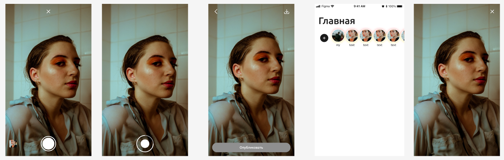

**Тестовое задание: Запись, загрузка и просмотр Фото/Видео материала.**

**Формат: История**

**Экран “Запись историй”**

1. Закрыть экран: (button)
    1. вернуться на предыдущий экран
        1. Главная
2. Фиксация передаваемого изображения: (button)
    1. Фото
    2. Видео
3. Выбор одного Фото/Видео материала с мобильного устройства (button)
    1. modal sheet(Фотопленка мобильного устройства)

**Экран запись видео**

1. Зум видео при помощи кнопки “Запись видео”
2. продолжительность записи видео 15сек.

**Экран “Опубликовать” историю:**

1. Вернуться на экран “**Запись историй**”
2. Скачать историю(Фото/Видео)на мобильное устройство (button)
3. Опубликовать историю (button)

**Экран Главная**

1. Иконки “Историй” листаются посредством свайпа.
2. История публикуется в “My”
    1. возможность повторного просмотра фото/видео материала(История)

**Экран “Просмотр истории”**

1. Закрыть экран: (button)
    1. вернуться на предыдущий экран
        1. Главная

**Запросы**:

- Доступ к микрофону(при записи Видео)
- Доступ к камере(при записи Видео/Фото)
- Доступ к Фото(при выборе Фото/Видео материала)

**Прим**.

- Экран “Запись историй” имеет:
    - Зум передаваемого изображения с камеры
- Экран “Запись видео” имеет:
    - Зум передаваемого видео с камеры
- Загружаемый материал(История) Удаляется - по истечении 24 часов.
- Длительность при повторном просмотре:
    - Фото — 5сек.
    - Видео — зависимость от продолжительности снятого материала. Макс. продолжительность — 15сек.

  
Дизайн:
    
